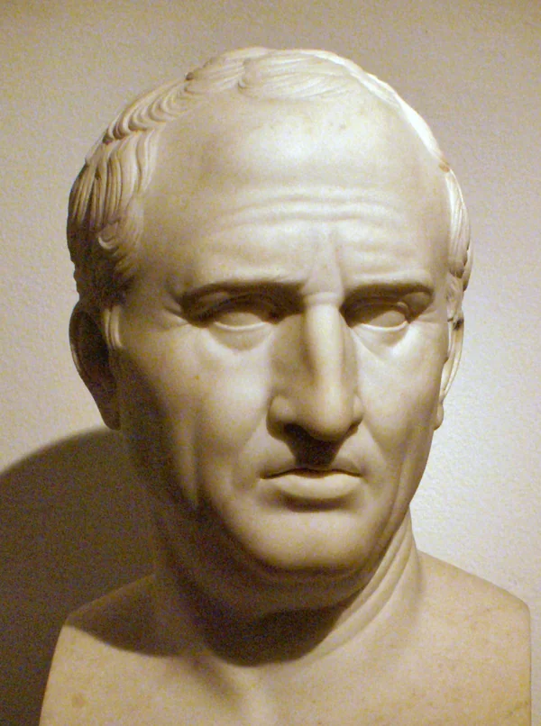

# Заголовок 1
## Заголовок 2
### Заголовок 3
#### Заголовок 4
##### Заголовок 5

Заголовок 1
=
Заголовок 2
-
 +  пункт списка
 +  пункт списка
 +  пункт списка

1. пункт списка
    +  пункт списка
    +  пункт списка
2. пункт списка

_______

Сегодня мне открылись две важнейшие истины о человеческом существовании.  
**Первое**: жизнь — это не что иное, как обыденность и работа в ней.  
 **Второе**: настоящие встречи происходят только тогда, когда вы видите в человеке не его недостатки, а его внутренний *Свет и Мир*. Я стараюсь учиться различать этот Свет и Мир в каждом, чтобы делиться с ними своей любовью.
***
> *ЦИЦЕРОН* : *Есть разница также между острым умом и тупым умом: как коринфская медь труднее ржавеет, так и острые умы труднее впадают в болезни и легче выходят из них, а тупые — нет.*

[„Если у тебя есть сад и библиотека, то у тебя есть все, что тебе нужно.“]

(Источник: https://ru.citaty.net/avtory/mark-tullii-tsitseron/) 

[img/image.png](img/image.png)

Item     | Value | Quantity
:------  |:-----:|:--------:
Computer |1600   |3
Phone    |12     |2
Pipe     |1      |1